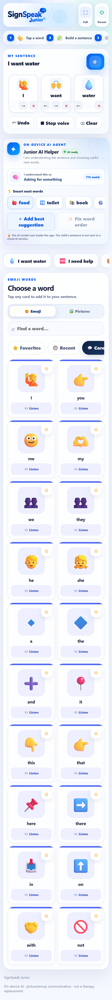
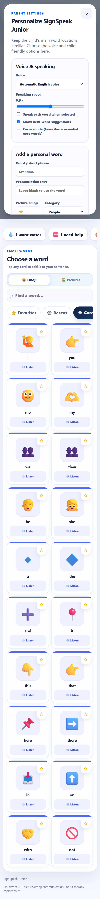

# SignSpeak Junior AI Mobile v2.0

SignSpeak Junior is a child-friendly communication and speech-support app for Android. It helps young users tap picture or emoji word cards, build simple sentences, and hear those sentences spoken aloud.

The v2.0 build also includes an on-device Junior AI Helper that predicts communication intent, suggests useful next words, and can improve short word order without sending the child's sentence to a cloud AI service.

> Design note: this is a communication and language-practice prototype. It is not a therapy replacement, diagnostic product, or emergency service.

## Screenshots

| Sentence Builder + AI Helper | Parent Settings |
| --- | --- |
|  |  |

## Download

Install the packaged Android build from:

[release/SignSpeak-Junior-AI-Mobile-v2.0.apk](release/SignSpeak-Junior-AI-Mobile-v2.0.apk)

SHA-256:

```text
EBCDD948BF4016116CAF694C7BBBBE7FE751F0C1757F5B703E9F0EADB25C20F9
```

Android may ask you to allow installs from the browser or file manager before opening the APK.

## What The App Does

- Builds sentences from large, child-friendly word cards.
- Speaks single words and full sentences using Android Text-to-Speech in the APK.
- Provides quick phrases such as "I want water", "I need help", and "I feel sick".
- Includes 100 built-in vocabulary cards across Core, People, Actions, Social, Feelings, Questions, Describing, and Things.
- Supports emoji mode and picture mode. Picture mode requests related online images at runtime, with emoji fallback if a photo fails.
- Offers favorites, recent words, category tabs, and search.
- Includes parent settings protected by a simple PIN. Default PIN: `1234`.
- Lets a parent add personal words, pronunciation text, emoji labels, and familiar photos.
- Keeps child settings, custom cards, favorites, and recent words on the device using local storage.

## Junior AI Helper

The included AI helper runs inside the app. It uses a compact self-trained natural language model based on TF-IDF features and logistic regression style scoring, plus a small transition language model for next-word ranking and short sentence ordering.

The helper can:

- Predict the child's likely communication intent.
- Suggest smart next words from vocabulary and context.
- Prioritize important help and safety words.
- Personalize suggestions using favorites and recent words when enabled.
- Reorder short sentences of two to seven words when the current order can be improved.

No OpenAI API key or cloud AI service is required for the included model.

## Repository Contents

```text
.
├── README.md
├── release/
│   └── SignSpeak-Junior-AI-Mobile-v2.0.apk
├── web/
│   ├── index.html
│   ├── styles.css
│   ├── app.js
│   ├── vocabulary.js
│   ├── ai_model.js
│   ├── ai_engine.js
│   └── assets/
│       └── signspeak-junior-logo.png
└── docs/
    └── screenshots/
        ├── home-sentence-builder.png
        └── parent-settings.png
```

The `web/` folder is the extracted web app bundle contained inside the APK. The complete original Android Studio or Gradle project was not present inside the APK, so this repository preserves the installable APK and the bundled web source that drives the app UI.

## Preview The Web UI

You can preview the extracted web interface locally by opening:

```text
web/index.html
```

Some mobile-only Android features, especially native Text-to-Speech through the APK bridge, are only available in the installed Android APK. In a desktop browser, the app falls back to browser speech synthesis when supported.

## Install Notes

1. Download the APK from the `release/` folder.
2. Transfer it to an Android phone or open it directly on the device.
3. Allow installation from the selected source if Android prompts for permission.
4. Open SignSpeak Junior.
5. Use the default parent PIN `1234` to customize voice, AI helper settings, and personal words.

## Privacy Notes

- The Junior AI model included here runs locally in the app bundle.
- Saved settings and custom vocabulary are stored on the device.
- Picture cards may request public online images at runtime when picture mode is enabled.
- Custom uploaded photos stay in the app's local storage on the device.

## Version

- App: SignSpeak Junior AI Mobile
- Build: `v2.0`
- Package artifact: `SignSpeak-Junior-AI-Mobile-v2.0.apk`

## License

No license file was included with the APK. Until a license is added by the owner, all rights are reserved.
